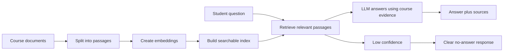

# Teaching Assistant Codebase Walkthrough

This guide explains the AI Teaching Assistant in non-technical terms for a
presentation about an LLM-resilient university course. The main idea is simple:
the app turns fixed course materials into a searchable course memory, then uses
an LLM only after it has found relevant evidence from those materials.

## Quick Access

When the app is running with `make run` or `python -m src.app`, use these URLs:

- Chat interface: [http://127.0.0.1:5000](http://127.0.0.1:5000)
- Setup checklist: [http://127.0.0.1:5000/setup](http://127.0.0.1:5000/setup)
- Document and index status: [http://127.0.0.1:5000/documents](http://127.0.0.1:5000/documents)
- Machine-readable health report: [http://127.0.0.1:5000/api/health](http://127.0.0.1:5000/api/health)
- Machine-readable document status: [http://127.0.0.1:5000/api/documents](http://127.0.0.1:5000/api/documents)

For a hosted demo, replace `http://127.0.0.1:5000` with the deployed HTTPS URL.

## One-Slide Summary

The teaching assistant is a course-bounded chatbot. It does not try to answer
from general internet knowledge. Instead, it:

- reads instructor-provided PDF, DOCX, and TXT files;
- breaks them into meaningful course passages;
- creates searchable embeddings for those passages;
- retrieves the most relevant passages for each student question;
- asks the LLM to answer only from that retrieved context;
- shows source evidence under the answer;
- says "I don't know" when the evidence is too weak;
- exposes health, document, test, and evaluation checks so the course team can
  detect problems before students do.

## End-to-End Flow



In classroom language: the system first looks in the assigned readings, then
lets the LLM explain what it found. If the readings do not support an answer,
the assistant should refuse to guess.

## Why This Supports an LLM-Resilient Course

| Resilience feature | What it means for teaching |
| --- | --- |
| Course-bounded answers | The assistant is steered toward the instructor's materials, not general model memory. |
| Source display | Students can see which document passages supported an answer. |
| Low-confidence gate | Weak retrieval produces a clear no-answer response instead of a confident hallucination. |
| Hybrid retrieval | The app searches by meaning and by exact terms, helping with both conceptual and keyword questions. |
| Diversity filtering | The answer context is not overloaded by repeated chunks from one document. |
| Answer verification | If the first answer looks weak, the service can retrieve more context and try again. |
| Bilingual behavior | Bulgarian questions get Bulgarian fallback messages; Cyrillic questions can be translated for English retrieval. |
| Stale-index detection | If course files change, the app can report that the searchable index should be rebuilt. |
| Strict indexing pipeline | Bad documents, empty text, malformed chunks, and inconsistent embeddings stop the build early. |
| Health pages | Instructors can check setup status without reading logs. |
| Retrieval evaluation | Course-specific test cases check whether the right sources are being retrieved. |
| Unit tests | The project tests the web app, retrieval, sessions, ingestion, deployment bootstrap, and safety checks. |

## Student-Facing Behavior

The chat interface has three modes:

- Ask: students ask a course question and receive an explanation with sources.
- Quiz: students ask for a multiple-choice question on a topic.
- Check answer: students submit an answer with the `a:` mode, and the assistant
  checks it against the previous course question and retrieved context.

The visible teaching pattern is: answer directly, explain intuition, add a small
example or implication when the course materials support it, and avoid unsupported
claims.

## Codebase Map in Plain Language

### Root Files

| File | What it does in non-technical terms |
| --- | --- |
| `README.md` | Main project guide: setup, indexing, running, evaluation, and deployment notes. |
| `run_instructions.txt` | Step-by-step local operating instructions for adding documents, building the index, and running checks. |
| `DEPLOYMENT_UBUNTU.md` | Operational notes for deploying the assistant on an Ubuntu laptop with the project's preferred tunnel pattern. |
| `settings.txt` | Course identity and behavior settings: course name, instructor, assistant name, model choices, retrieval limits, and confidence thresholds. |
| `.env.example` | Template for local secrets such as the OpenAI API key and Flask session secret. |
| `requirements.txt` | Python packages needed by the app, indexing scripts, and tests. |
| `Makefile` | Short commands for common tasks such as setup, indexing, running, testing, evaluating, and cleaning generated data. |
| `Dockerfile` | Container recipe for running the app in a production-like environment. |
| `render.yaml` | Optional Render.com deployment blueprint for a hosted demo. |
| `.dockerignore` | Prevents unnecessary local files from being copied into the Docker image. |
| `.gitignore` | Keeps local secrets, generated indexes, and temporary files out of Git. |
| `file-structure.rtf` | Older human-readable project structure note. |

### Application Modules

| File | What it does in non-technical terms |
| --- | --- |
| `src/app.py` | The web front door. It serves the chat page, setup page, document page, and JSON API endpoints. |
| `src/service.py` | The main teaching workflow. It interprets the student's mode, retrieves context, asks the LLM, checks answers, handles follow-ups, and returns sources. |
| `src/main.py` | A command-line entry point and compatibility layer for older imports. It lets someone ask one prompt from the terminal. |
| `src/retrieval.py` | The evidence finder. It searches the course index by meaning and exact terms, merges results, avoids too many repeated sources, estimates confidence, and formats context for the LLM. |
| `src/llm.py` | The LLM adapter. It sends prompts to OpenAI, checks whether an answer actually answered the question, detects syllabus-like questions, and translates Cyrillic retrieval queries into English when useful. |
| `src/prompts.py` | The teaching instructions. It defines the answer style, language policy, quiz prompt, and no-answer messages. |
| `src/settings.py` | The configuration reader. It finds the course root, document folder, data folder, `.env` file, and course settings. |
| `src/clients.py` | The dependency loader. It loads OpenAI, FAISS, and NumPy and gives clear setup errors when a package or API key is missing. |
| `src/health.py` | The setup inspector. It checks settings, API keys, documents, generated files, metadata, and stale-index status. |
| `src/index_status.py` | The document inventory. It fingerprints source files, lists generated index artifacts, validates index reports, and detects changed documents. |
| `src/sessions.py` | Short chat memory. It keeps the recent browser conversation so follow-up questions and answer checks have context. |
| `src/evaluation.py` | Retrieval evaluation logic. It scores whether expected sources and terms were found for course-specific test questions. |
| `src/errors.py` | Human-readable error categories for invalid input, missing configuration, and missing knowledge base data. |
| `src/__init__.py` | Marks `src` as a Python package. |

### Indexing and Operations Scripts

| File | What it does in non-technical terms |
| --- | --- |
| `scripts/prepare_documents.py` | Reads PDF, DOCX, and TXT course files, extracts text, detects simple headings, splits the text into chunks, and records source fingerprints. |
| `scripts/embed_documents.py` | Sends each chunk to the embedding model so similar ideas can be found later, then stores the results. |
| `scripts/create_final_data.py` | Builds the FAISS search index, writes searchable metadata, and creates an index report describing exactly what was indexed. |
| `scripts/bootstrap_index.py` | On startup, checks whether the index is ready and can rebuild it automatically when documents and API keys are present. |
| `scripts/evaluate_rag.py` | Runs retrieval evaluation cases and reports whether the search layer found the expected evidence. |
| `scripts/start_web.sh` | Production launcher: optionally bootstraps the index, then starts Gunicorn with one worker. |

### Web Interface

| File | What it does in non-technical terms |
| --- | --- |
| `templates/index.html` | The chat page students see. It includes the message area, mode tabs, sample prompts, and links to setup/document pages. |
| `templates/setup.html` | A checklist page for instructors showing whether configuration and generated files are ready. |
| `templates/documents.html` | A dashboard showing input files, generated artifacts, index freshness, and rebuild commands. |
| `static/js/queryProcess.js` | Browser behavior for sending questions, switching modes, rendering assistant answers, showing sources, clearing chat, and resizing the message box. |
| `static/css/styles.css` | Visual styling for the chat, setup, and document pages. |

### Course Data and Evaluation Files

| File or folder | What it does in non-technical terms |
| --- | --- |
| `documents/` | Place instructor-approved source materials here. The demo files are small synthetic examples. |
| `documents/demo_course_overview.txt` | Demo course overview used for public or local tests. |
| `documents/demo_assessment_policy.txt` | Demo assessment policy used for public or local tests. |
| `documents/files.txt` | Placeholder note so the document folder is kept in Git. |
| `data/.gitkeep` | Keeps the generated-data folder in Git while ignoring the actual local index files. |
| `eval/rag_cases.example.json` | Template for course-specific retrieval checks. |
| `eval/rag_cases.demo.json` | Demo retrieval checks for the included sample documents. |

### Tests

| File | What it protects |
| --- | --- |
| `tests/test_app.py` | Web routes, chat API behavior, error handling, session clearing, and setup/document pages. |
| `tests/test_main.py` | The main teaching workflow: settings, no-answer behavior, quiz mode, Bulgarian handling, verification fallback, follow-ups, and answer checking. |
| `tests/test_retrieval.py` | Hybrid retrieval, BM25 keyword search, rank fusion, confidence thresholds, source diversity, and Cyrillic fallback behavior. |
| `tests/test_ingestion.py` | Document extraction, chunk metadata, source fingerprints, embedding validation, and FAISS index creation. |
| `tests/test_health.py` | Setup diagnostics for missing keys, missing documents, bad metadata, bad embeddings, and stale indexes. |
| `tests/test_index_status.py` | Document fingerprinting and stale-index detection. |
| `tests/test_evaluation.py` | Retrieval evaluation scoring and summaries. |
| `tests/test_sessions.py` | Short conversation memory and trimming behavior. |
| `tests/test_runtime_cache.py` | Cache behavior for settings, FAISS resources, and OpenAI setup. |
| `tests/test_deploy_bootstrap.py` | Startup index-building behavior for deployments and external course roots. |
| `tests/test_llm.py` | Model-specific chat parameter handling for newer and older OpenAI chat models. |
| `tests/test_static_ops.py` | Browser safety, static UI behavior, Docker hardening, dependency pinning, and operational files. |

## Live Demo Narrative

For a presentation, a concise demonstration can be:

1. Open [http://127.0.0.1:5000/documents](http://127.0.0.1:5000/documents) and show that the system knows which course documents are indexed.
2. Open [http://127.0.0.1:5000](http://127.0.0.1:5000) and ask a course-specific question.
3. Expand the source list under the answer and point out that the answer is tied to course evidence.
4. Ask an out-of-scope question, such as a policy from another university, and show the no-answer behavior.
5. Switch to Quiz mode for a topic, then use Check answer mode to evaluate a student's response.
6. Open [http://127.0.0.1:5000/setup](http://127.0.0.1:5000/setup) to show operational readiness checks.

## Quarto Reveal.js Snippets

Quarto's reveal.js format supports normal links, explicit HTML iframes, and slide
background iframes. The official reference is here:
[Quarto reveal.js slide backgrounds](https://quarto.org/docs/presentations/revealjs/#iframe-backgrounds).

### Minimal Deck Header

```yaml
---
title: "LLM-Resilient University Course"
subtitle: "A course-bounded teaching assistant"
format:
  revealjs:
    theme: simple
    slide-number: true
    preview-links: auto
---
```

### Simple Link Slide

Use this when you want the most reliable presentation setup.

```markdown
## Live Assistant

[Open the local Teaching Assistant](http://127.0.0.1:5000)

- Setup: [http://127.0.0.1:5000/setup](http://127.0.0.1:5000/setup)
- Documents: [http://127.0.0.1:5000/documents](http://127.0.0.1:5000/documents)
```

### Embedded Demo Slide

Use this when the deck and the app are running on the same machine.

```markdown
## Live Teaching Assistant

<iframe
  src="http://127.0.0.1:5000"
  title="AI Teaching Assistant"
  style="width: 100%; height: 620px; border: 1px solid #ddd; border-radius: 8px;"
  loading="lazy">
</iframe>
```

### Full-Slide Interactive Background

Use this for an immersive demo slide. When `background-interactive` is enabled,
the app receives mouse and keyboard input, so slide controls may be less
convenient while the iframe is active.

```markdown
## {background-iframe="http://127.0.0.1:5000" background-interactive="true"}
```

### Architecture Slide

````markdown
## Resilient Answer Flow

```{mermaid}
flowchart LR
  A["Course files"] --> B["Chunks"]
  B --> C["Embeddings"]
  C --> D["Search index"]
  E["Student question"] --> F["Relevant course evidence"]
  D --> F
  F --> G["LLM explanation"]
  G --> H["Answer with sources"]
  F --> I["Weak evidence"]
  I --> J["I don't know"]
```
````

If exporting to PDF or presenting from a hosted HTTPS slide deck, the local
iframe may not render. In that case, use the simple link slide or a screenshot.

## Suggested Presentation Framing

Use these phrases if you want a non-technical explanation:

- "The assistant is a supervised doorway into the course readings, not an
  unrestricted chatbot."
- "The LLM explains retrieved evidence; retrieval decides what evidence is
  allowed into the answer."
- "The system is designed to fail visibly when course evidence is missing."
- "The setup and document pages make the invisible parts of RAG visible to the
  instructor."
- "Evaluation cases test the course memory before students rely on it."

## Operational Commands Worth Showing

```bash
make index      # rebuild the course memory after documents change
make run        # start the local web app
make test       # run the automated safety checks
make evaluate   # run retrieval quality checks
```

These are good teaching points because they show that the course assistant is
not only a prompt. It is a maintained instructional system with data, checks,
and a visible operating process.
